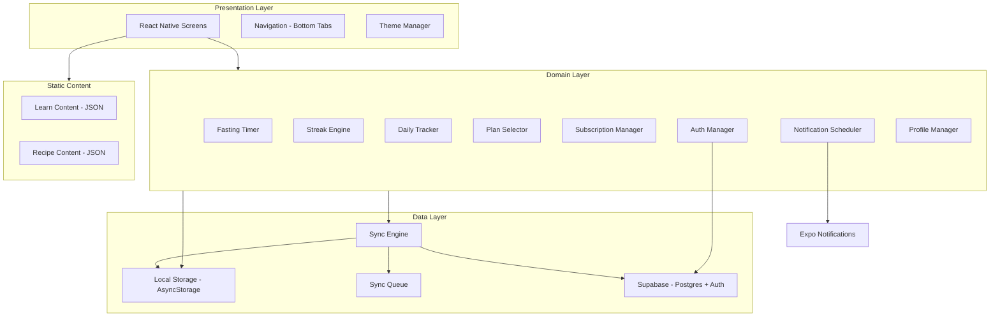
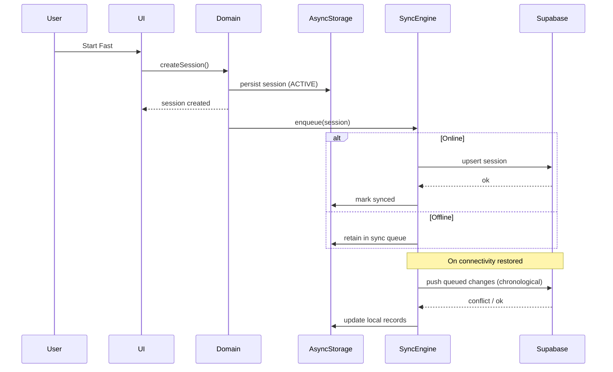

# Design Document — FastTrack

## Overview

FastTrack is an offline-first intermittent fasting mobile application built with React Native (Expo), TypeScript, and Supabase. The app enables users to manage fasting schedules via a system-clock-based timer, track daily health metrics, maintain streak-based gamification, access educational content, and interact with a freemium subscription model.

The architecture prioritizes offline resilience: all critical data (active sessions, daily stats, streaks) is persisted locally in AsyncStorage and synced to Supabase when connectivity is available. The fasting timer operates entirely from UTC timestamps and the device system clock, ensuring accuracy across app restarts, backgrounding, and reboots. Streak computation is derived from the full session history using the device's current local timezone (MVP), with stored `timezoneOffsetMinutes` reserved for audit only.

For MVP, the subscription system uses a local mock flag (`FREE` / `PRO_MOCK`) with no real billing integration. Post-MVP pricing: Monthly R39.99, Yearly R199.99 (approximately R16.67/month, ~58% savings vs monthly), with a 7-day free trial. Guest mode provides full free-tier access with local-only storage and a migration path to authenticated accounts.

### Key Design Decisions

| Decision | Rationale |
|---|---|
| **Offline-first with AsyncStorage** | Mid-range Android devices may have unreliable connectivity; local-first ensures the timer and tracking never stall. |
| **UTC timestamps + local display** | Eliminates ambiguity in stored times; local conversion happens only at the presentation layer. |
| **Streak recomputation from history** | Cached streak values are never the source of truth — recomputing from sessions prevents drift after sync, timezone changes, or data corrections. |
| **Session-aware sync conflict rules** | Terminal statuses (COMPLETED, ENDED_EARLY, CANCELLED) must never be overwritten by ACTIVE; ACTIVE-vs-ACTIVE conflicts resolved by latest updatedAt with startTime protection. |
| **Static bundled content (MVP)** | Learn and Recipe content ships as local JSON/assets, avoiding network dependency and simplifying the MVP. |
| **Local mock subscription** | Decouples feature gating logic from billing integration, allowing full Pro feature development and testing in MVP. |

## Architecture

### High-Level Architecture



### Layered Architecture

The application follows a three-layer architecture:

1. **Presentation Layer**: React Native screens, navigation (React Navigation bottom tabs), theme management, and the Circular Timer component. All time values are converted from UTC to local time at this layer only.

2. **Domain Layer**: Business logic components — Fasting Timer, Streak Engine, Daily Tracker, Plan Selector, Subscription Manager, Notification Scheduler, Auth Manager, and Profile Manager. Each component exposes a clear interface and operates on domain models.

3. **Data Layer**: AsyncStorage for local persistence, Supabase (Postgres + Auth) for cloud storage, and the Sync Engine that bridges the two with a queue-based approach and session-aware conflict resolution.

### Offline-First Data Flow



## Components and Interfaces

### Auth Manager

Handles user authentication via Supabase Auth, session restoration, token refresh, and guest mode.

```typescript
interface AuthManager {
  register(email: string, password: string): Promise<AuthResult>;
  login(email: string, password: string): Promise<AuthResult>;
  logout(): Promise<void>;
  restoreSession(): Promise<AuthSession | null>;
  refreshToken(): Promise<AuthSession | null>;
  startGuestSession(): Promise<GuestSession>;
  migrateGuestToAccount(email: string, password: string): Promise<MigrationResult>;
  isGuest(): boolean;
  isAuthenticated(): boolean;
}

type AuthResult = { success: true; session: AuthSession } | { success: false; error: AuthError };
type AuthError = 'INVALID_CREDENTIALS' | 'EMAIL_IN_USE' | 'NETWORK_UNAVAILABLE' | 'SERVER_ERROR' | 'EMAIL_EXISTS_GUEST_MIGRATION';
type MigrationResult = { success: true } | { success: false; error: string; dataPreserved: true };
```

**Guest-to-Account Migration Rules:**
- If the email is new, create Supabase account and migrate guest data.
- If the email already exists, do NOT overwrite or silently merge data. Show: "An account already exists for this email. Please log in to continue."
- For MVP, automatic guest-data merge into an existing account is blocked. Post-MVP may add a manual merge flow.
- **Offline migration is not supported.** Migration requires creating a new Supabase account, which requires network connectivity. If the user attempts migration while offline, the Auth Manager displays: "An internet connection is required to create your account. Your local data is safe — please try again when you're online." The user remains in guest mode and no data is lost.

### Fasting Timer

Manages fasting session lifecycle — creation, active display computation, persistence/recovery, and completion.

```typescript
interface FastingTimer {
  startFast(plan: FastingPlan): Promise<FastingSession>;
  endFastEarly(): Promise<FastingSession>;
  cancelFast(): Promise<FastingSession>;
  getActiveSession(): Promise<FastingSession | null>;
  restoreSession(): Promise<FastingSession | null>;
  computeProgress(session: FastingSession, now: Date): TimerState;
  checkClockIntegrity(session: FastingSession, now: Date, lastCheckTime: Date): ClockCheckResult;
  checkForwardClockJump(session: FastingSession, now: Date, lastTimerCheckUtc: Date, lastKnownElapsedMs: number): ForwardJumpResult;
}

interface TimerState {
  remainingMs: number;
  elapsedMs: number;
  progressFraction: number; // 0.0 to 1.0
  remainingFormatted: string; // HH:MM:SS
  elapsedFormatted: string;  // HH:MM:SS
  isComplete: boolean;
}

type ClockCheckResult = { valid: true } | { valid: false; driftSeconds: number };
type ForwardJumpResult = { suspicious: false } | { suspicious: true; jumpMs: number };
```

**Clock Tampering / Forward Jump Detection:**
- During ACTIVE sessions, the timer stores `lastTimerCheckUtc` and `lastKnownElapsedMs` locally (at minimum every 10 seconds).
- A suspicious forward jump is detected when `(currentTime - lastTimerCheckUtc) - expectedElapsedSinceLastCheck > 10 minutes`.
- On detection: do NOT auto-complete the fast; show a warning; continue timer based on original startTime/endTime; mark session with local-only `CLOCK_SUSPECT` flag.
- A `CLOCK_SUSPECT` session cannot become a Qualifying_Fast until the user confirms the session summary.
- `CLOCK_SUSPECT` is NOT a session status — it is a local-only flag in AsyncStorage, not synced to Supabase.
- **Multi-device limitation (MVP):** The CLOCK_SUSPECT flag is single-device only. If a session is marked suspect on Device A and the user confirms it, then syncs to Supabase, Device B will pull the session without any suspect indicator. This is an accepted trade-off for MVP because multi-device support is Post-MVP. When multi-device lands, CLOCK_SUSPECT semantics will need to be reworked (e.g., promoted to a synced field or replaced with server-side validation).

### Streak Engine

Computes streaks from the full session history. Never trusts cached values as source of truth. Qualifying_Fast includes both COMPLETED and ENDED_EARLY sessions meeting the 90% threshold. CANCELLED sessions never qualify.

```typescript
interface StreakEngine {
  recomputeStreaks(sessions: FastingSession[], plans: FastingPlan[], now: Date): StreakResult;
  isQualifyingFast(session: FastingSession, plan: FastingPlan): boolean;
  getStreakDays(sessions: FastingSession[], plans: FastingPlan[]): Set<string>; // "YYYY-MM-DD" local dates
  shouldShortCircuit(cached: StreakRecord, localSessions: FastingSession[]): boolean;
}

interface StreakResult {
  currentStreak: number;
  longestStreak: number;
  lastStreakDate: string | null; // "YYYY-MM-DD"
  streakDays: Set<string>;
}
```

**Streak Recomputation Performance:**
- Full recomputation from `localSessions` is the correctness fallback and the default behaviour.
- The short-circuit check compares the cached `StreakRecord` against derived metadata from `localSessions`:
  - `cached.updatedAt` matches the maximum `updatedAt` across all sessions in `localSessions`, AND
  - `cached.lastStreakDate` matches the most recent qualifying-fast local date computed from `localSessions`, AND
  - `cached.sessionCountSnapshot` matches `localSessions.length`.
- If any of the three checks fail, `shouldShortCircuit` returns `false` and full recomputation runs.
- When in doubt, recompute. Correctness is more important than optimization.

**Streak Grace Period:**
- The current streak remains "alive" through the end of the current local calendar day if the user completed a Qualifying_Fast yesterday but has not yet completed one today.
- The streak resets only after the current local day ends without a Qualifying_Fast.
- The numeric streak value must not increment until today's Qualifying_Fast is completed.

### Daily Tracker

Records and retrieves daily health metrics keyed by local date.

```typescript
interface DailyTracker {
  saveDailyStats(stats: Partial<DailyStats>): Promise<DailyStats>;
  getDailyStats(localDate: string): Promise<DailyStats | null>;
  validateMetric(metric: MetricType, value: number): ValidationResult;
}

type MetricType = 'waterIntake' | 'weight' | 'calories' | 'steps';
type ValidationResult = { valid: true } | { valid: false; warning: string };
```

### Plan Selector

Manages fasting plan display, selection, and Pro gating.

```typescript
interface PlanSelector {
  getAvailablePlans(subscriptionStatus: SubscriptionTier): PlanDisplay[];
  selectPlan(planId: string): Promise<void>;
  createCustomPlan(fastingHours: number): Promise<FastingPlan>;
  isProPlan(plan: FastingPlan): boolean;
}

interface PlanDisplay {
  plan: FastingPlan;
  isLocked: boolean;
  isSelected: boolean;
}
```

### Subscription Manager

Manages local mock subscription state and feature gating.

```typescript
interface SubscriptionManager {
  getSubscriptionStatus(): Promise<SubscriptionStatus>;
  isProFeature(featureId: ProFeature): boolean;
  setMockStatus(tier: SubscriptionTier): Promise<void>; // dev/test only
  handleProDowngrade(): Promise<void>;
}

type SubscriptionTier = 'free' | 'pro' | 'pro_mock';
type ProFeature = 'PRO_PLANS' | 'CUSTOM_PLANS' | 'EXTENDED_FASTS' | 'DETAILED_ANALYTICS' | 'STREAK_INSIGHTS' | 'ACHIEVEMENT_BADGES';
```

**Note on SubscriptionTier:** The `'pro'` value is unreachable in MVP (only `'free'` and `'pro_mock'` are produced by the local mock subscription system). It is included in the type union now to avoid breaking refactors when real billing integration is added Post-MVP. All MVP type guards and switch statements should treat `'pro'` and `'pro_mock'` identically for feature-gating purposes — i.e., both grant Pro access.

### Notification Scheduler

Schedules and manages local notifications via Expo Notifications.

```typescript
interface NotificationScheduler {
  scheduleFastingMilestones(session: FastingSession): Promise<ScheduledNotification[]>;
  cancelSessionNotifications(sessionId: string): Promise<void>;
  rescheduleSessionNotifications(session: FastingSession): Promise<ScheduledNotification[]>;
  scheduleWaterReminders(config: WaterReminderConfig): Promise<void>;
  scheduleWeighInReminder(time: string): Promise<void>;
  cancelRemindersByType(type: ReminderType): Promise<void>;
  requestPermissions(): Promise<PermissionResult>;
  revalidateOnLaunch(session: FastingSession): Promise<void>;
}

type ReminderType = 'FASTING_MILESTONES' | 'WATER_REMINDERS' | 'WEIGH_IN_REMINDER';
type PermissionResult = 'GRANTED' | 'DENIED' | 'ALREADY_GRANTED';
```

### Sync Engine

Manages bidirectional sync between AsyncStorage and Supabase with session-aware conflict resolution.

```typescript
interface SyncEngine {
  enqueue(record: SyncableRecord): Promise<void>;
  pushPendingChanges(): Promise<SyncResult>;
  pullRemoteChanges(): Promise<SyncResult>;
  resolveConflict(local: SyncableRecord, remote: SyncableRecord): SyncableRecord;
  resolveSessionConflict(local: FastingSession, remote: FastingSession): FastingSession;
  getSyncQueueSize(): Promise<number>;
  refreshTokenAndRetry(failedEntry: SyncQueueEntry): Promise<SyncRetryResult>;
}

interface SyncResult {
  pushed: number;
  pulled: number;
  conflicts: number;
  errors: SyncError[];
}

type SyncRetryResult = { success: true } | { success: false; reason: string };
type SyncableRecord = FastingSession | DailyStats | StreakRecord | NotificationPreference | UserProfile;
```

**Note on SubscriptionStatus exclusion:** SubscriptionStatus is intentionally excluded from `SyncableRecord` and `SyncQueueEntry.recordType` for MVP. Because MVP uses local-only PRO_MOCK state with `provider: 'local'`, there is no remote source of truth to sync against. When real billing integration lands Post-MVP (Requirement 20), SubscriptionStatus will be added to the sync union and the source of truth will become RevenueCat / Google Play Billing rather than the local record.

**Session Conflict Resolution (ACTIVE-vs-ACTIVE):**
- Terminal status beats ACTIVE.
- If both are terminal, latest updatedAt wins.
- If both are ACTIVE, latest updatedAt wins, but startTime must not change unless the session was created locally and has no remote equivalent.
- If ACTIVE records differ in endTime due to plan change, latest updatedAt wins.

**RLS/Auth Sync Error Handling:**
- If Supabase rejects a write due to auth/RLS/JWT expiry, attempt token refresh once.
- If token refresh succeeds, retry the failed write once.
- If retry fails, keep the change in the sync queue and show a non-blocking sync warning.
- Auth/RLS sync failures must NEVER interrupt an active fasting timer.

### Profile Manager

Manages user profile data and app settings.

```typescript
interface ProfileManager {
  getProfile(): Promise<UserProfile>;
  updateDisplayName(name: string): Promise<void>;
  updateUnitPreference(unit: 'metric' | 'imperial'): Promise<void>;
  updateThemePreference(theme: 'light' | 'dark' | 'system'): Promise<void>;
  deleteAccount(): Promise<void>;
}
```

### Theme Manager

Applies light/dark themes with the dark green premium accent.

```typescript
interface ThemeManager {
  getActiveTheme(): Theme;
  setTheme(preference: 'light' | 'dark' | 'system'): void;
  onThemeChange(callback: (theme: Theme) => void): () => void;
}

interface Theme {
  mode: 'light' | 'dark';
  colors: {
    primary: string;       // dark green accent
    background: string;
    surface: string;
    text: string;
    textSecondary: string;
    timerArc: string;
    timerTrack: string;
    cardPastel: string[];
    error: string;
    warning: string;
    success: string;
    locked: string;        // lock indicator color
  };
}
```

**Pastel card color rotation:** The `cardPastel` array provides a deterministic palette for content cards (daily stats, plan cards, recipe cards). Color assignment is deterministic — derived from a stable hash of the card's primary identifier (e.g., `planId`, `recipeId`, or stat metric name) modulo the array length. Colors must NOT be assigned randomly or by render index, because that causes colors to reshuffle on re-render and looks broken. New cards added Post-MVP must use the same hash-based assignment to remain stable.

## Data Models

### Fasting Session

```typescript
interface FastingSession {
  sessionId: string;          // UUID
  userId: string;             // Supabase Auth userId or "guest"
  planId: string;
  startTime: string;          // UTC ISO 8601
  endTime: string;            // UTC ISO 8601 (planned end)
  actualEndTime: string | null; // UTC ISO 8601 (set when ended early)
  status: SessionStatus;
  durationFasted: number | null; // seconds
  timezoneOffsetMinutes: number; // audit only, not used in MVP calculations
  createdAt: string;          // UTC ISO 8601
  updatedAt: string;          // UTC ISO 8601
}

type SessionStatus = 'ACTIVE' | 'COMPLETED' | 'ENDED_EARLY' | 'CANCELLED';
const TERMINAL_STATUSES: SessionStatus[] = ['COMPLETED', 'ENDED_EARLY', 'CANCELLED'];
```

### Fasting Plan

```typescript
interface FastingPlan {
  planId: string;
  name: string;               // e.g., "16:8"
  fastingHours: number;
  eatingHours: number;
  description: string;
  isPro: boolean;
  isCustom: boolean;
  createdByUserId: string | null;
  createdAt: string;
}
```

### Daily Stats

```typescript
interface DailyStats {
  statsId: string;
  userId: string;
  localDate: string;          // "YYYY-MM-DD" in user's local timezone
  waterIntake: number | null;  // always stored in millilitres (1 glass = 250 ml)
  weight: number | null;       // always stored in kilograms
  calories: number | null;     // always stored in kcal
  steps: number | null;        // integer count
  timezoneOffsetMinutes: number;
  createdAt: string;
  updatedAt: string;
}
```

**Canonical Storage Units:**
- `waterIntake`: always millilitres. UI may accept glasses (1 glass = 250 ml), converted at UI/service boundary.
- `weight`: always kilograms. UI may display lb based on `unitPreference`, converted at UI/service boundary.
- `calories`: always kcal.
- `steps`: integer count.
- Conversions happen at the UI/service boundary, never in storage.

### Streak Record

```typescript
interface StreakRecord {
  streakId: string;
  userId: string;
  currentStreak: number;      // cached — recomputed from history
  longestStreak: number;      // cached — recomputed from history
  lastStreakDate: string | null; // "YYYY-MM-DD"
  sessionCountSnapshot: number; // count of sessions at last full recompute, used for short-circuit detection
  createdAt: string;
  updatedAt: string;
}
```

### Subscription Status

```typescript
interface SubscriptionStatus {
  subId: string;
  userId: string;
  tier: SubscriptionTier;     // "free" | "pro" | "pro_mock" — only "free" and "pro_mock" are produced in MVP
  expiryDate: string | null;
  trialStartDate: string | null;
  trialEndDate: string | null;
  provider: 'local' | 'revenuecat' | 'google_play'; // MVP only emits 'local'
  createdAt: string;
  updatedAt: string;
}
```

### User Profile

```typescript
interface UserProfile {
  userId: string;
  displayName: string;
  email: string;
  selectedPlanId: string;
  unitPreference: 'metric' | 'imperial';
  themePreference: 'light' | 'dark' | 'system';
  onboardingCompleted: boolean;
  createdAt: string;
  updatedAt: string;
}
```

### Notification Preference

```typescript
interface NotificationPreference {
  prefId: string;
  userId: string;
  fastingMilestones: boolean;
  waterReminders: boolean;
  waterReminderInterval: number; // minutes, default 120
  weighInReminder: boolean;
  weighInReminderTime: string;   // "HH:MM" local time
  createdAt: string;
  updatedAt: string;
}
```

### Sync Queue Entry

```typescript
interface SyncQueueEntry {
  id: string;
  recordType: 'fasting_session' | 'daily_stats' | 'streak' | 'notification_preference' | 'profile';
  recordId: string;
  operation: 'CREATE' | 'UPDATE';
  payload: SyncableRecord;
  createdAt: string;           // UTC ISO 8601
  retryCount: number;
}
```

**Note on deletion operations:** The `SyncQueueEntry.operation` enum intentionally only supports `CREATE` and `UPDATE`. Account deletion (Requirement 19 AC6) is handled as a direct, online-required Supabase operation outside the sync queue, because:
- Deletion is a rare, user-confirmed action.
- The user is necessarily online when initiating it (the confirmation flow blocks until network is available).
- Queueing a deletion creates ambiguous semantics if the user reinstalls or returns to the app.
- If network connectivity is lost mid-deletion, the user is informed and asked to retry. The local data is cleared only after successful Supabase deletion.

### AsyncStorage Key Convention

| Key | Description |
|---|---|
| `@fasttrack:activeSession` | Current active fasting session |
| `@fasttrack:dailyStats:{YYYY-MM-DD}` | Daily stats for a specific date |
| `@fasttrack:streak` | Cached streak record |
| `@fasttrack:profile` | User profile |
| `@fasttrack:subscriptionStatus` | Subscription tier and metadata |
| `@fasttrack:notificationPrefs` | Notification preferences |
| `@fasttrack:syncQueue` | Array of pending sync entries |
| `@fasttrack:scheduledNotifications` | Map of sessionId → notification IDs |
| `@fasttrack:onboardingComplete` | Boolean flag |
| `@fasttrack:guestMode` | Boolean flag for guest session |
| `@fasttrack:lastClockCheck` | Last system time check for drift detection |
| `@fasttrack:lastTimerCheckUtc` | UTC timestamp of last timer tick (for forward jump detection) |
| `@fasttrack:lastKnownElapsedMs` | Elapsed ms at last timer tick (for forward jump detection) |
| `@fasttrack:clockSuspect:{sessionId}` | CLOCK_SUSPECT flag for a specific session (local-only) |
| `@fasttrack:sessionHistory` | Local cache of completed sessions |

## Error Handling

### Sync Error Hierarchy

1. **Network errors**: Queue changes locally, retry on connectivity restoration.
2. **Auth/RLS/JWT errors**: Attempt token refresh once → retry write once → if still failing, keep in sync queue and show non-blocking warning.
3. **Storage errors**: Blocking alert for active session persistence failures; attempt Supabase recovery for authenticated users on read failures.
4. **Notification errors**: Log and show non-blocking message; never affect timer or session state.

**Critical invariant**: Auth/RLS sync failures and notification failures must NEVER interrupt an active fasting timer.

### Clock Integrity

- **Backward drift** (>60s): Warning displayed, timer continues from original timestamps.
- **Forward jump** (>10 min ahead of expected progression): Warning displayed, session marked CLOCK_SUSPECT locally, timer continues from original timestamps, session cannot qualify for streaks until user confirms.
- **Accepted trade-off (forward jump false positives):** Legitimate NTP corrections (e.g., phone connecting to a new cell tower after a long offline period) may trigger false-positive warnings if the correction exceeds 10 minutes. This is acceptable noise for MVP given the alternative (allowing clock manipulation to fabricate streaks) is worse. The threshold may be revisited Post-MVP based on user feedback.

## Testing Strategy

### QA Reference Devices

- Samsung Galaxy A14 or equivalent Android device (3–4 GB RAM class)
- Redmi Note 12 or equivalent Android device (3–4 GB RAM class)

### Performance Targets

- Fasting dashboard usable within 2 seconds on reference devices.
- Timer updates once per second without visible UI jank.

### PRO_MOCK QA Requirements

Because MVP uses PRO_MOCK instead of real billing:
- QA must run full regression tests in both FREE and PRO_MOCK states.
- All Pro-gated plans and screens must be tested with PRO_MOCK enabled before release.
- This ensures feature gating logic works correctly in both subscription states.
- Type guards and feature-gating checks must treat `'pro'` and `'pro_mock'` identically. Although `'pro'` is unreachable in MVP, code paths that branch on tier should be written to handle it correctly so Post-MVP integration is a flag flip rather than a refactor.

### Accessibility Testing

- Normal text contrast: minimum 4.5:1 ratio.
- Large text: WCAG AA large-text threshold of 3:1 where applicable.
- Interactive controls and meaningful icons must remain clearly distinguishable in both light and dark mode.
- Full TalkBack navigation testing required.

### Notification Content Guidelines

- Avoid strong physiological or medical claims in notifications and Learn content.
- 12-hour milestone notification uses: "12 Hours Reached" / "You've reached 12 hours of fasting. Body responses vary from person to person."
